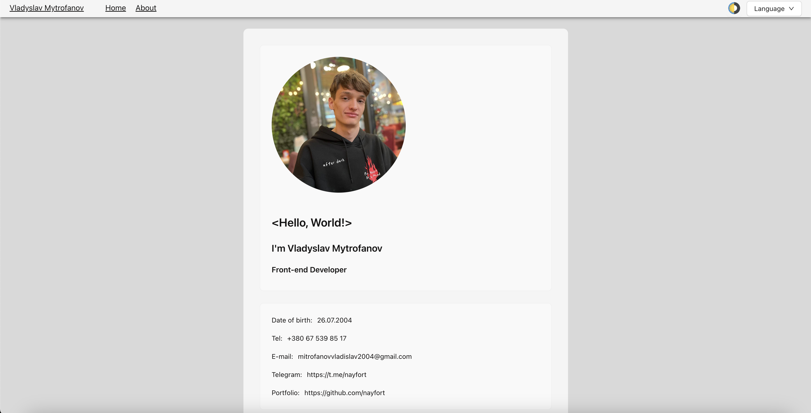
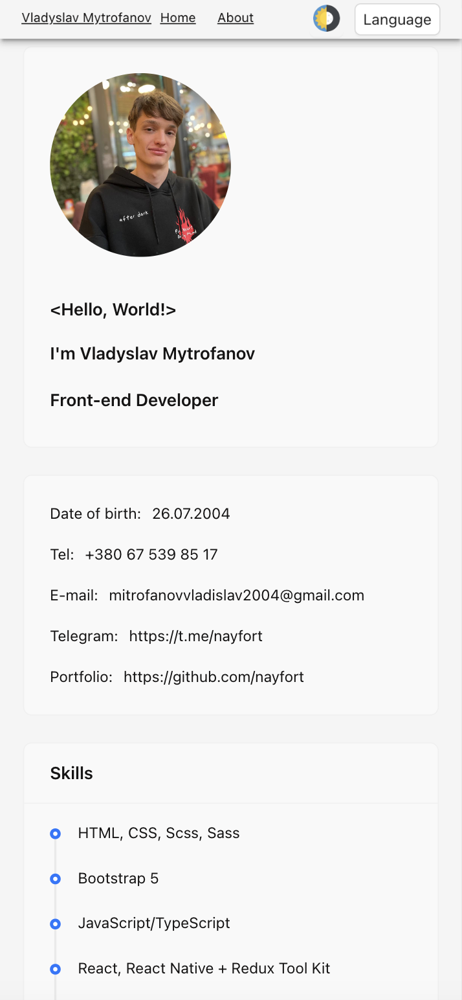

# CV Vladyslav Mytrofanov

This is my Desktop and Mobile Resume.




## How to start:

1. **Clone the repository:**

    ```bash
    git clone https://github.com/nayfort/resume.git
    cd resume
    ```

2. **Install all necessary libraries:**

   From the root directory, run the following command:

    ```bash
    npm install
    ```

   This command will install all the dependencies listed in the `package.json` file.

3. **Run the project locally:**

   After installing the dependencies, you can start the development server with:

    ```bash
    npm run dev
    ```

   This command will start the server, and you can view your resume by navigating to `http://localhost:5173` in your web browser.

## Additional Notes:

- Make sure you have [Node.js](https://nodejs.org/) installed on your machine.
- If you encounter any issues during the installation, make sure your Node.js and npm versions are up to date.

## Project Structure:

- **src/**: Contains the source code for the application.
- **public/**: Contains the static files like `index.html`.

## Available Scripts:

In the project directory, you can run:

- `npm install`: Installs all dependencies.
- `npm run dev`: Starts the development server.
